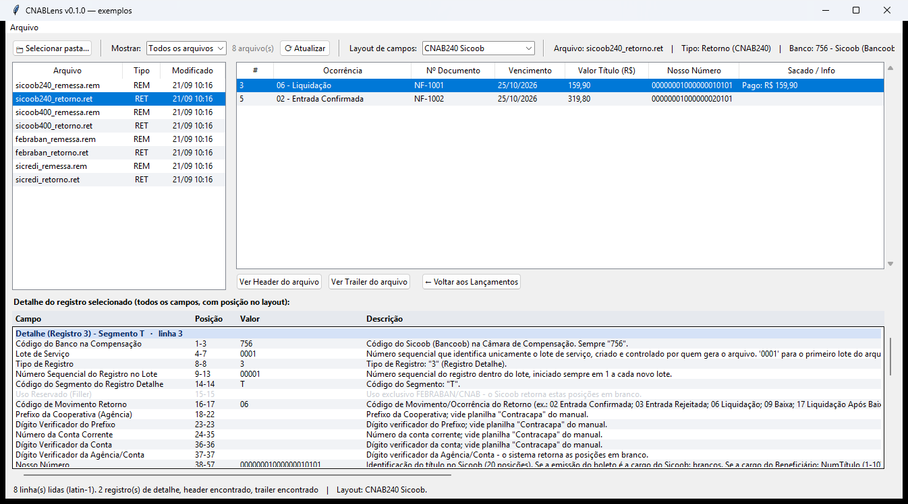
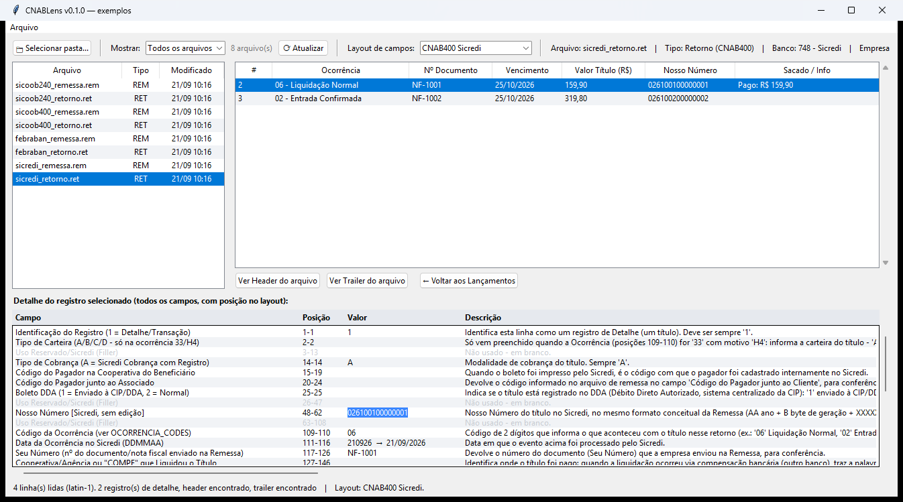

# CNABLens

**Uma lente para arquivos CNAB.** Abra um arquivo de **remessa** ou **retorno** de cobrança bancária
(CNAB400 ou CNAB240) e veja cada lançamento com **o nome correto de cada campo**, a posição no layout, o
valor e a descrição oficial. Aplicativo Windows, roda 100% no seu computador, sem instalação.

[](https://github.com/BrunodosSantosVaz/cnab-lens/actions/workflows/ci.yml)
[](https://github.com/BrunodosSantosVaz/cnab-lens/releases/latest)
[](https://github.com/BrunodosSantosVaz/cnab-lens/releases)
[](LICENSE)




## Índice

1. [Para que serve](#para-que-serve)
2. [Recursos](#recursos)
3. [Download e instalação](#download-e-instalação)
4. [Como usar](#como-usar)
5. [Layouts suportados](#layouts-suportados)
6. [Arquivos de exemplo](#arquivos-de-exemplo)
7. [Guia rápido de CNAB](#guia-rápido-de-cnab)
8. [Para desenvolvedores](#para-desenvolvedores)
9. [Versões e releases](#versões-e-releases)
10. [Segurança e privacidade](#segurança-e-privacidade)
11. [Limitações conhecidas](#limitações-conhecidas)
12. [Contribuindo](#contribuindo)
13. [Licença, avisos e fontes](#licença-avisos-e-fontes)

## Para que serve

Arquivos CNAB são texto de largura fixa: cada linha tem 400 (ou 240) caracteres e o significado de
cada trecho depende da posição e do banco. Abrir um deles no Bloco de Notas mostra só uma parede de
números. Este programa faz a leitura por você:

- **Conferir um retorno**: quais boletos foram liquidados, com que valor, em que data, com qual
  ocorrência (ex.: "06 - Liquidação Normal").
- **Conferir uma remessa** antes de enviar ao banco: valores, vencimentos, pagador, instruções.
- **Depurar integração**: descobrir em qual posição está um campo e o que ele deveria conter, sem
  abrir o manual do banco.
- **Estudar o layout**: cada campo traz a descrição transcrita do manual oficial.

## Recursos

- **CNAB400 e CNAB240**, remessa e retorno, com detecção automática do formato.
- **Layouts por banco**: FEBRABAN (padrão), Sicredi, Sicoob e Santander (400) e Sicoob e Santander (240),
  incluindo os registros de QR Code/PIX do Santander. O layout do banco é
  escolhido sozinho pelo código no Header, e dá para trocar na hora sem reabrir o arquivo.
- **Navegação por pasta**: escolha uma pasta, filtre por extensão e veja o tipo de cada arquivo
  (REM/RET) na lista.
- **Todos os campos de cada registro**: nome, posição (início-fim), valor e descrição. Valores em
  centavos viram `R$ 1.234,56` e datas viram `25/10/2026`, sempre mostrando também o valor bruto.
- **Títulos CNAB240 por segmento**: um lançamento reúne seus segmentos (P+Q+R na remessa, T+U no
  retorno), cada um em uma faixa própria. Header/Trailer de arquivo e de lote em um clique.
- **Copiar qualquer valor**: os textos do painel de campos são selecionáveis. Arraste para
  selecionar, `Ctrl+C` para copiar. Duplo clique seleciona a célula inteira. Sem botão extra.
- **Tabelas de códigos**: ocorrências de retorno, comandos de remessa, bancos e espécies de título
  aparecem traduzidos.
- **Leitura tolerante**: datas em `DDMMAA`, `AAAAMMDD` ou `DDMMAAAA`; só formata quando a data é
  válida, nunca inventa uma. Campos reservados aparecem esmaecidos.
- **Somente leitura**: o programa nunca altera nem grava nenhum arquivo.

## Download e instalação

**Não precisa instalar nada** (nem Python).

1. Baixe o executável da versão mais recente na página de
   [**Releases**](https://github.com/BrunodosSantosVaz/cnab-lens/releases/latest) (por exemplo,
   `CNABLens-v0.1.0-windows-x64.exe`): a marcada **Latest** é a versão de **produção**. As versões de
   produção também ficam com cópia no repositório, em [`releases/`](releases/).
2. *(Recomendado)* confira o hash no PowerShell e compare com o `SHA256SUMS.txt` da mesma release:

   ```powershell
   Get-FileHash .\CNABLens-v0.1.0-windows-x64.exe -Algorithm SHA256
   ```

3. Dê dois cliques no `.exe`.

**Requisitos:** Windows 10 ou 11, 64 bits.

*Verificação avançada:* os executáveis compilados pelo CI têm **atestado de procedência** (prova de que
foram gerados por este repositório, naquele commit): `gh attestation verify CNABLens-vX.Y.Z-windows-x64.exe --repo BrunodosSantosVaz/cnab-lens`.

> **Aviso do Windows / antivírus.** O executável **não é assinado digitalmente**, então o SmartScreen
> pode mostrar "O Windows protegeu seu computador". Clique em **Mais informações → Executar assim
> mesmo**. Alguns antivírus também costumam marcar como suspeitos executáveis gerados com PyInstaller
> (falso positivo comum). Por isso o código-fonte é aberto: você pode auditá-lo e compilar o seu próprio
> `.exe` (veja [Para desenvolvedores](#para-desenvolvedores)).

## Como usar

1. Abra o programa e clique em **Selecionar pasta...** (ou `Ctrl+O`), escolhendo a pasta com os
   arquivos CNAB. Se houver mais de um tipo de arquivo, o programa pergunta qual extensão listar; dá
   para trocar depois em **Mostrar**.
2. Clique em um arquivo da lista à esquerda. O topo mostra o resumo: tipo (Remessa/Retorno), formato
   (CNAB400/CNAB240), banco, empresa, data de geração e número de lançamentos.
3. A grade de lançamentos lista cada título com ocorrência, nº do documento, vencimento, valor, nosso
   número e pagador (ou valor pago, no retorno).
4. Clique em um lançamento: o painel de baixo mostra **todos os campos** dele.
5. **Ver Header do arquivo** e **Ver Trailer do arquivo** mostram os registros de abertura e
   fechamento; **← Voltar aos Lançamentos** retorna ao último título visto.
6. Se o layout escolhido automaticamente não for o que você quer, troque em **Layout de campos**. O
   layout precisa ter o mesmo tamanho de linha do arquivo (400 ou 240): se você escolher um de tamanho
   diferente, o programa avisa e mantém o layout atual.

### Copiando valores

| Ação | Resultado |
|------|-----------|
| Arrastar o mouse no painel de campos | seleciona o trecho |
| Duplo clique numa célula | seleciona a célula inteira (valor, nome do campo ou descrição) |
| `Ctrl+C` | copia a seleção |
| `Ctrl+A` | seleciona todo o painel |
| `Ctrl+C` na grade de lançamentos | copia a linha selecionada (colunas separadas por tab; cola direto numa planilha) |

O painel é somente leitura: não dá para digitar nem colar nele.

## Layouts suportados

O seletor **Layout de campos** oferece:

| Layout | Linha | Banco | Escolha automática | Fonte | Testado com arquivo real |
|--------|:-----:|-------|:------------------:|-------|:------------------------:|
| CNAB400 FEBRABAN (Padrão) | 400 | genérico (Itaú, BB, Bradesco, Caixa e outros) | sim, para bancos sem layout próprio | Manual CNAB 400 do Itaú, conferido com o retorno do Banco do Brasil | não |
| CNAB400 Sicredi | 400 | 748 | sim | Manual CNAB 400 Cobrança, versão 2.4 (out/2022) | sim (retornos) |
| CNAB400 Sicoob | 400 | 756 | sim | Planilha oficial `Layout_Cobranca_CNAB400.xls` (versão publicada em mai/2025) | não |
| CNAB400 Santander | 400 | 033 (e 353, código legado no Header) | sim | Manual oficial "Layout Cobrança H7800 - CNAB 353/400 posições", versão 2.37 (fev/2026) | não |
| CNAB240 Sicoob | 240 | 756 | sim (e padrão para bancos de 240 sem layout próprio) | Planilha oficial de layouts CNAB240 do Sicoob (arquivo 081, lote 040/044) | não |
| CNAB240 Santander | 240 | 033 | sim | Manual oficial "Layout Cobrança H7815 - CNAB 240 posições", versão 8.5 (fev/2026) | não |

Notas por layout:

- **FEBRABAN**: usado por muitos bancos com pequenas variações. Se o seu banco divergir, o valor bruto
  continua correto e só o rótulo do campo pode diferir.
- **Sicredi**: layout próprio (Tipo de Cobrança, Boleto Híbrido/Pix, Nosso Número `AA/BXXXXX-D`
  separado em partes, Beneficiário Final etc.). A data do Header é `AAAAMMDD`.
- **Sicoob 400**: o Detalhe tipo 1 é o único registro de título; o Trailer é diferente na remessa e
  no retorno; o retorno não traz o nome do pagador (só o CPF/CNPJ).
- **Sicoob 240**: Header/Trailer de arquivo e de lote, segmentos P, Q, R, S (remessa) e T, U
  (retorno), com Nosso Número de 20 posições. É o layout usado para arquivos CNAB240 de bancos sem layout
  próprio: a estrutura de lote/segmento (padrão FEBRABAN) é a mesma, mas campos específicos do banco
  podem divergir.
- **Santander 400**: além do Detalhe (tipo `1`), descreve o registro `8` (tipo de pagamento e dados de
  QR Code/PIX, opcional) e as mensagens `2` e `4` a `7` na remessa, e o registro `2` (QR Code/PIX) no
  retorno. Esses registros aparecem agrupados sob o boleto a que pertencem. O Header aceita o banco
  `033` ou o código legado `353`.
- **Santander 240**: Header/Trailer de arquivo e de lote, segmentos P, Q, R, S (remessa) e T, U (retorno),
  com Nosso Número de 13 posições. O segmento **Y** (QR Code/PIX e tipo de pagamento na remessa;
  QR Code/PIX e cheque no retorno) é identificado pelo sub-código das posições 18-19 (`Y-03`, `Y-53`,
  `Y-04`), e o segmento S tem dois formatos, escolhidos pela posição 18.

## Arquivos de exemplo

A pasta [`exemplos/`](exemplos/) traz um par remessa/retorno **100% fictício** para cada layout
(empresa, CPF/CNPJ, pagadores e valores inventados), ideal para conhecer o programa:

| Arquivo | Layout |
|---------|--------|
| `febraban_remessa.rem` / `febraban_retorno.ret` | CNAB400 FEBRABAN |
| `sicredi_remessa.rem` / `sicredi_retorno.ret` | CNAB400 Sicredi |
| `sicoob400_remessa.rem` / `sicoob400_retorno.ret` | CNAB400 Sicoob |
| `sicoob240_remessa.rem` / `sicoob240_retorno.ret` | CNAB240 Sicoob |
| `santander400_remessa.rem` / `santander400_retorno.ret` | CNAB400 Santander (com QR Code/PIX) |
| `santander240_remessa.rem` / `santander240_retorno.ret` | CNAB240 Santander (com segmento Y-03) |

Abra o programa, selecione a pasta `exemplos/` e clique nos arquivos. Para regenerá-los:
`python scripts/gerar_exemplos.py`.



## Guia rápido de CNAB

- **Remessa**: arquivo que a **empresa envia ao banco** com os títulos a cobrar (ou instruções sobre
  eles: baixa, alteração de vencimento, protesto...).
- **Retorno**: arquivo que o **banco devolve** contando o que aconteceu (título registrado, liquidado,
  baixado, rejeitado...).
- **CNAB400**: linhas de 400 caracteres. **Header** (tipo `0`) abre o arquivo, cada **Detalhe** (tipo
  `1`) é um título, o **Trailer** (tipo `9`) fecha.
- **CNAB240**: linhas de 240 caracteres, com o tipo do registro na posição 8: Header de Arquivo (`0`),
  Header de Lote (`1`), Detalhe (`3`), Trailer de Lote (`5`) e Trailer de Arquivo (`9`). O detalhe se
  divide em **segmentos** (letra na posição 14): na remessa de cobrança, P (dados do título), Q
  (pagador), R (multa/desconto) e S (mensagens); no retorno, T (título) e U (valores e datas).
- Valores vêm sem vírgula (`0000015990` = R$ 159,90) e datas sem separador.

## Para desenvolvedores

### Estrutura do repositório

```
cnab-lens/
├── src/                          Código-fonte Python (só biblioteca padrão)
│   ├── cnab400_reader.py         Interface gráfica (Tkinter) e leitura dos arquivos
│   ├── cnab400_layouts.py        Registro central dos layouts (alimenta o seletor da tela)
│   ├── cnab400_layout.py         Layout FEBRABAN genérico, bancos e ocorrências
│   ├── cnab400_layout_sicredi.py Layout CNAB400 Sicredi
│   ├── cnab400_layout_sicoob.py  Layout CNAB400 Sicoob
│   ├── cnab400_layout_santander.py Layout CNAB400 Santander (inclui QR Code/PIX e mensagens)
│   ├── cnab240_layout_sicoob.py  Layout CNAB240 Sicoob (arquivo, lote, segmentos)
│   ├── cnab240_layout_santander.py Layout CNAB240 Santander (arquivo, lote, segmentos P a Y)
│   └── version.py                Versão do programa
├── tests/                        Testes automatizados (unittest)
├── scripts/
│   ├── build_exe.py              Compila o .exe (build local; as versões oficiais saem do CI)
│   ├── gerar_exemplos.py         Gera os arquivos fictícios de exemplos/
│   └── processo/                 Configuração do GitHub (labels, painéis, automações)
├── exemplos/                     Arquivos CNAB fictícios de exemplo
├── releases/                     Cópias das versões de produção (vX.Y.Z/ + SHA256SUMS.txt)
├── docs/                         Processo de desenvolvimento e imagens do README
├── .github/                      Workflows (CI, build, release), modelos de issue/PR, automações
├── requirements-build.txt        Dependência de build (PyInstaller)
├── CHANGELOG.md, CONTRIBUTING.md, SECURITY.md, CODE_OF_CONDUCT.md
└── LICENSE
```

### Rodando a partir do código-fonte

Requer **Python 3.10 ou superior com Tkinter** (o instalador oficial do Python para Windows já
inclui). Nenhuma biblioteca externa é necessária para rodar.

```powershell
git clone https://github.com/BrunodosSantosVaz/cnab-lens.git
cd cnab-lens
python src\cnab400_reader.py
```

### Testes

```powershell
python -m unittest discover -s tests -v
```

A suíte cobre as tabelas de layout, a leitura dos arquivos de exemplo (400 e 240), a formatação de valores
e datas e a interface (cópia de valores, alinhamento, troca de layout). Ela roda a cada pull request no
GitHub Actions (Windows).

### Gerando o executável

```powershell
pip install -r requirements-build.txt
python scripts\build_exe.py
```

O script compila com PyInstaller (fora do repositório, sem deixar `build/` ou `.spec`), embute os
metadados de versão no `.exe` e grava o resultado, com o `SHA256SUMS.txt`, em `build-local/` (ignorada
pelo Git). A versão vem de `src/version.py`. Os executáveis **oficiais** (candidatas e produção) são
gerados pelo CI e publicados nas Releases, não à mão.

### Como o programa funciona

1. `CnabFile` lê as linhas cruas, detecta o tamanho (240 ou 400), o tipo (remessa/retorno) e o banco
   pelo Header, e classifica cada registro (posição 1 no CNAB400; posição 8 e segmento na posição 14
   no CNAB240).
2. Um **layout** (`cnab400_layouts.py`) diz quais campos, nomes e posições aplicar a cada tipo de
   registro. Trocar o layout só reaplica os nomes, sem reler o disco.
3. No CNAB240, `CnabGroup` reúne os segmentos de um título para a tela tratá-los como um lançamento.
4. A interface mostra a grade de lançamentos e o painel de campos.

### Adicionando um novo layout (outro banco)

1. Crie `src/cnab400_layout_<nome>.py` (ou `cnab240_layout_<nome>.py`) no estilo de
   `cnab400_layout_sicredi.py`: listas de tuplas `(nome do campo, início, fim, descrição)` que cobrem
   as posições 1–400 (ou 1–240) sem lacunas, mais as tabelas de ocorrência. Cada módulo tem uma
   validação de contiguidade (`python src/cnab400_layout_<nome>.py`).
2. Registre o layout em `LAYOUTS` e `LAYOUT_ORDER` (e, para escolha automática pelo código do banco,
   em `AUTO_LAYOUT_BY_BANK`) em `src/cnab400_layouts.py`. O seletor da tela se atualiza sozinho.
3. Use estes nomes de campo para o resumo da grade funcionar: `Nosso Número` (ou
   `Nosso Número [Parte]`), `Número do Documento`, `Data de Vencimento`, `Valor Nominal`,
   `Código da Ocorrência` / `Identificação da Ocorrência` / `Código de Movimento`, `Nome do Sacado` ou
   `Nome do Pagador` e `Valor Pago`. Campos com "Data" no nome são formatados como data; os com
   "Valor", "Juros", "Mora", "Desconto", "Abatimento", "IOF", "Tarifa" ou "Despesa" como moeda,
   exceto se o nome também trouxer "Código", "Tipo", "Taxa", "Percentual" etc.
4. Gere um arquivo fictício para o layout (veja `scripts/gerar_exemplos.py`) e confira na tela.

## Versões e releases

O projeto usa [versionamento semântico](https://semver.org/lang/pt-BR/) (`MAIOR.MENOR.PATCH`) e cada
versão é registrada no [CHANGELOG](CHANGELOG.md). Antes da 1.0, `MENOR` sobe com funcionalidade nova e
`PATCH` com correção.

**A versão diz o ambiente**, e todos os `.exe` ficam no mesmo lugar, a página de
[Releases](https://github.com/BrunodosSantosVaz/cnab-lens/releases):

| Ambiente | Como reconhecer | Badge |
|----------|-----------------|-------|
| **Produção** | release **Latest**, versão `X.Y.Z` | *produção* |
| **Homologação** | **Pre-release** `X.Y.Z-rc.N` (release candidata) | *homologação* |

Toda homologação tem versão: antes de testar, o CI cria a candidata `vX.Y.Z-rc.N`. Aprovada, o **mesmo
binário** é promovido a produção (`vX.Y.Z`) pela ação *Publicar em produção*, com a aprovação do mantenedor. Enquanto não há candidata
aberta, a homologação é a própria versão em produção. As pre-releases são para quem quer ajudar a
testar: para uso normal, baixe a versão **Latest**. Mudanças que **não alteram o programa** (documentação, testes,
automação) levam a label `sem-executavel`: não geram versão nem candidata e chegam à `main` pelo botão
*Publicar sem executável*. As cópias das versões de produção também ficam no
repositório, em [`releases/`](releases/) (uma pasta por versão, com o `.exe` e o `SHA256SUMS.txt`). O ciclo
completo (planejamento, testes, build no CI, aprovação e publicação) está em
[docs/processo.md](docs/processo.md).

## Segurança e privacidade

- **Tudo local.** O programa não usa rede, não envia nada para lugar nenhum, não tem telemetria e não
  grava nem altera arquivos. Ele só lê o arquivo que você seleciona.
- **Dados pessoais.** Arquivos CNAB reais contêm nomes, CPF/CNPJ, endereços e valores de terceiros
  (dados protegidos pela LGPD). **Nunca anexe arquivos reais em issues, pull requests ou fóruns.**
  Para relatar um problema, substitua os dados por fictícios ou envie só as posições e os valores
  envolvidos, sem identificação de pessoas.
- **Executável não assinado.** Confira o SHA-256 (veja [Download](#download-e-instalação)) ou compile
  a partir do código-fonte.
- **Encontrou uma vulnerabilidade?** Não publique detalhes em uma issue aberta: veja a
  [política de segurança](SECURITY.md) e use o relato privado do GitHub.

## Limitações conhecidas

- Os layouts **Sicoob** (400 e 240) foram transcritos das planilhas oficiais do Sicoob e os layouts
  **Santander** (400 e 240), dos manuais oficiais do Santander; todos foram testados com arquivos
  sintéticos, mas **ainda não foram conferidos com arquivos reais**. O layout FEBRABAN também não foi
  testado com arquivos reais. Só o Sicredi foi validado com arquivos reais.
- **Santander**: os manuais têm pequenas inconsistências (por exemplo, o banco aparece como `33` no Header de
  Arquivo do CNAB240, e alguns campos declaram tamanho diferente das posições). O programa segue as
  posições; confira com um arquivo real do banco. Os manuais não trazem histórico de revisões e o site do
  Santander não permite download automático, então uma versão nova precisa ser conferida à mão.
- **Sicoob 400, retorno**: o CPF/CNPJ do pagador (posições 343–356) tem baixa confiança: a planilha
  oficial escreve 343–357, o que contradiz o tamanho de 14 posições declarado.
- **Sicoob 240**: a planilha oficial mais recente encontrada é de 2019 (publicada em 2021). As
  tabelas de motivos de ocorrência e rejeição vêm de fonte secundária (a planilha só cita alguns
  códigos e remete à tabela FEBRABAN), e o campo "Motivo da Ocorrência" do Segmento T aparece com o
  valor bruto. Os segmentos Y e W não são descritos pelo manual e aparecem como "Conteúdo do Registro
  (não mapeado neste layout)".
- **CNAB400** cobre só o Detalhe obrigatório (tipo `1`), exceto no layout **Santander**, que também
  descreve os registros opcionais `8` e `2`, `4` a `7`. Nos demais layouts, registros opcionais (mensagem,
  rateio, beneficiário final etc.) não são interpretados.
- **Sicredi**: a "Tabela de Motivos" do retorno não é decodificada (valor bruto).
- Campos de uso exclusivo do banco podem variar entre instituições: o valor bruto continua correto, mas
  o nome do campo pode não corresponder ao do seu banco. Nesse caso, compare com o manual do banco e
  abra uma issue.
- O programa lê um arquivo por vez e não valida regras de negócio (dígito verificador, soma do
  trailer etc.): ele **interpreta**, não **audita**.

## Contribuindo

O CNABLens é open source (licença MIT) e aceita contribuição de qualquer pessoa: uma pergunta, um problema
encontrado ou uma alteração no código. Contribuições são bem-vindas, principalmente:

- **Conferir um layout com arquivo real** (informe apenas o banco, o formato e as posições que não
  bateram, **sem dados pessoais**).
- **Novos bancos e layouts** (veja [Adicionando um novo layout](#adicionando-um-novo-layout-outro-banco)).
- Correções de rótulos e descrições, e melhorias na interface.

### Para onde vai cada pedido

| Quero… | Vá para | Observação |
|--------|---------|------------|
| Tirar uma dúvida de uso | [Discussions](https://github.com/BrunodosSantosVaz/cnab-lens/discussions) → **Q&A** | Conversa: não vira issue |
| Sugerir uma ideia ou um banco novo | [Discussions](https://github.com/BrunodosSantosVaz/cnab-lens/discussions) → **Ideas** | Se amadurecer, o mantenedor a transforma em épico |
| Relatar um bug | [Nova issue](https://github.com/BrunodosSantosVaz/cnab-lens/issues/new/choose) → formulário **Bug** | Informe versão, passos para reproduzir e resultado esperado × obtido |
| Avisar de um campo que não bate com o manual, ou pedir um banco | [Nova issue](https://github.com/BrunodosSantosVaz/cnab-lens/issues/new/choose) → formulário **Layout ou banco** | Cite a fonte oficial (manual, versão e data) |
| Alterar o código, a documentação ou os testes | **Pull request** a partir de um fork (passos abaixo) | Sempre para a branch `develop`, ligado a uma issue |
| Relatar uma vulnerabilidade | [Relato privado](https://github.com/BrunodosSantosVaz/cnab-lens/security/advisories/new) | Nunca em issue pública ([SECURITY.md](SECURITY.md)) |

**Nunca anexe arquivo CNAB real** (nomes, CPF/CNPJ e valores de terceiros): use dados fictícios ou informe só
as posições e os valores envolvidos.

### Enviando uma alteração

1. **Tenha uma issue.** Comente em uma existente (as com `good first issue` são um bom começo) ou abra uma.
   Vale para **toda** alteração, até uma correção pequena de texto: o número da issue faz parte do nome da
   branch e do pull request.
2. **Faça um fork** e crie a branch **a partir da `develop`** (não da `main`), com o número da issue:
   `feature/<n>-<slug>` (ex.: `feature/12-exportar-csv`) ou `bugfix/<n>-<slug>` para correção de bug.
3. **Programe com testes.** Um assunto por pull request. Para bug, escreva primeiro o teste que falha.
   Rode `python -m unittest discover -s tests -v` antes de enviar.
4. **Abra o pull request para a `develop`**, preenchendo o modelo e escrevendo `Refs #<n>` na descrição
   (não `Closes`: a issue fecha sozinha quando a versão é publicada).
5. **Espere o CI.** Os checks `check` (compilação e testes) e `regras` (nome da branch, destino e referência
   à issue) precisam passar. Se falhar, corrija com novos commits na mesma branch.

### E depois?

O mantenedor revisa e responde. Você **não** mescla, aprova nem mexe em versão ou `CHANGELOG.md`: quando o
PR é aprovado, a esteira o inclui na próxima release, gera uma versão de teste (`rc`) e, depois de
testada, a publica. Seus commits mantêm a sua autoria no histórico, e a issue é fechada sozinha na
publicação. Não há prazo garantido de resposta (projeto mantido em tempo parcial).

Regras que valem sempre: **inclua testes**; use dados fictícios; só biblioteca padrão do Python; textos em
português do Brasil; cite a fonte oficial de qualquer posição nova ou alterada. O passo a passo detalhado
está em [CONTRIBUTING.md](CONTRIBUTING.md), o processo completo em [docs/processo.md](docs/processo.md) e a
conduta esperada no [Código de Conduta](CODE_OF_CONDUCT.md).

## Licença, avisos e fontes

Distribuído sob a **[Licença MIT](LICENSE)**.

**Aviso.** Este é um projeto independente e **não tem vínculo com nenhum banco, cooperativa ou com a
FEBRABAN**. Os nomes Sicoob, Sicredi, Itaú, Banco do Brasil e demais são marcas de seus respectivos
titulares e aparecem apenas para identificar os layouts. O software é fornecido "como está", sem
garantia. Confirme sempre valores e situação de títulos com o seu banco antes de tomar decisões
financeiras.

### Fontes dos layouts

As posições e descrições dos campos vêm da documentação técnica pública dos bancos (as descrições são
resumos em português dos manuais):

| Layout | Fonte |
|--------|-------|
| CNAB400 FEBRABAN | [Itaú, Cobrança Bancária CNAB 400 (jan/2017)](https://download.itau.com.br/bankline/layout_cobranca_400bytes_cnab_itau.pdf), conferido com o [retorno CNAB 400 do Banco do Brasil](https://www.bb.com.br/docs/pub/emp/empl/dwn/Doc2628CBR643Pos7.pdf) |
| CNAB400 Sicredi | [Manual CNAB 400 Cobrança, versão 2.4 (out/2022)](https://www.sicredi.com.br/media/produtos/filer_public/2022/09/26/manual_cnab_400_2-4_260922.pdf) |
| CNAB400 Sicoob | [Planilha oficial `Layout_Cobranca_CNAB400.xls`](https://www.sicoob.com.br/documents/20128/263767178/Layout_Cobranca_CNAB400.xls/675009c2-3ed6-3156-ea46-54cf78088652?version=1.0&t=1747656841831&download=true) (abas Remessa e Retorno) |
| CNAB240 Sicoob | [Planilha oficial de layouts CNAB240](https://www.sicoob.com.br/documents/3068856/0/layout-cnab-240.xls/5bfadf52-4278-3d28-0b69-b09b467aad45) (abas Remessa e Retorno; layout de arquivo 081, lote 040/044) |
| CNAB400 Santander | Manual "Layout Cobrança H7800 - CNAB 353/400 posições", versão 2.37 (fev/2026), na [página de layouts do Santander](https://www.santander.com.br/layout-de-arquivos) |
| CNAB240 Santander | Manual "Layout Cobrança H7815 - CNAB 240 posições", padrão Santander/Multibanco, versão 8.5 (fev/2026), na [página de layouts do Santander](https://www.santander.com.br/layout-de-arquivos) |

Conferências cruzadas (sem cópia de código): projetos open source
[brcobranca](https://github.com/kivanio/brcobranca), [laravel-boleto](https://github.com/eduardokum/laravel-boleto)
e [cnab-layouts](https://github.com/glauberportella/cnab-layouts); as tabelas de motivos do CNAB240 do
Sicoob seguem a tabela FEBRABAN conforme o projeto [ACBr](https://github.com/frones/ACBr). Os links
acima foram acessados em ago/set de 2026 e podem mudar: o banco pode publicar versões mais novas.

### Componentes de terceiros no executável

O `.exe` empacota o interpretador **Python** (licença PSF), o **Tcl/Tk** (licença BSD) e é gerado com o
**PyInstaller** (GPLv2 com exceção que permite distribuir o executável gerado sob a licença do seu
próprio programa).
